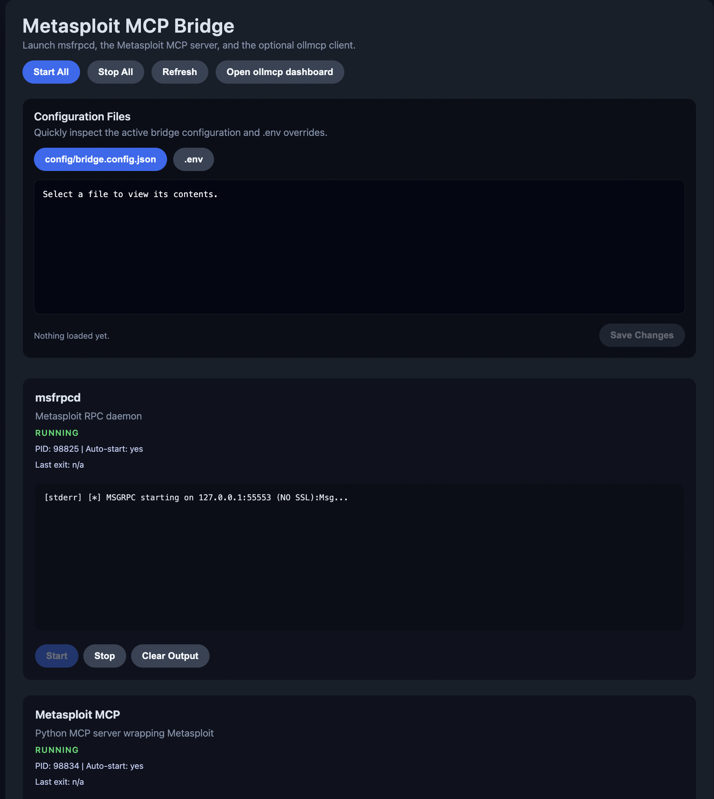

# Metasploit MCP ↔️ Ollama Bridge

This repo ships a lightweight Node.js + TypeScript supervisor that knows how to

- start or monitor `msfrpcd` (Metasploit RPC)
- run the Python-based [GH05TCREW/MetasploitMCP](https://github.com/GH05TCREW/MetasploitMCP) server
- launch the `ollmcp` CLI so local Ollama models can call MCP tools
- keep the Ollama daemon (`ollama serve`) running if you want a one-click stack

> ⚠️ **Only target systems you are authorized to test.** This bridge exposes full Metasploit automation to connected AI agents.

---

## Fast Start (GUI-First Path)

Follow this flow when you just want everything running with the least typing.

1. **Prep the Python side once**
   ```bash
   cd MetasploitMCP
   uv sync                     # installs the MCP server into .venv
   ```

2. **Configure the supervisor**
   ```bash
   cd ..                       # back to repo root
   cp .env.example .env        # edit with your ports/credentials
   # optional: tweak config/bridge.config.json for paths
   npm install
   ```

3. **Launch the GUI**
   ```bash
   npm run gui
   ```

4. **Open the dashboard** at http://127.0.0.1:4173 (set `BRIDGE_GUI_PORT` to change the port).

5. **Start services from the page**
   - Click “Start” on `msfrpcd` first (or “Start All”).
   - Once msfrpcd is running, start “Metasploit MCP”.
   - Start “Ollama” if you want the daemon managed for you.
   - Start “ollmcp CLI” only when you want an agent driving the tools.

6. **Watch logs inline.** Each card shows the rolling log buffer and exposes Start/Stop controls. Errors such as connection failures or missing Python deps show up here first.

7. **Shut everything down** via “Stop All” or by stopping each card in reverse order when you’re done.



That’s it—you now have msfrpcd, the MCP server, Ollama, and the `ollmcp` client all managed in one place.

---

## Other Ways to Start the Stack

Prefer terminals or manual control? Use whichever option fits your workflow.

### 1. CLI supervisor (headless)

```bash
npm run bridge          # start all auto-managed services once
npm run dev             # same thing with tsx watch
```

- Services honor the `autoStart...` flags in `config/bridge.config.json` / `.env`.
- Stop the stack with `Ctrl+C` when you’re done.

### 2. Makefile shortcuts

```bash
make install            # npm install
make bridge             # npm run bridge
make dev                # npm run dev
make python-install     # (cd MetasploitMCP && uv sync)
make python-serve       # uv run MetasploitMCP.py ...
```

Set `UV=/custom/path/to/uv` or `BRIDGE_CONFIG_PATH=/abs/config.json` before running `make` if you maintain multiple profiles.

### 3. Manual commands (debugging)

```bash
# 1) Metasploit RPC
export MSF_USER=msf MSF_PASSWORD=changeme
msfrpcd -U $MSF_USER -P $MSF_PASSWORD -a 127.0.0.1 -p 55553 -S

# 2) MCP server (inside MetasploitMCP/)
uv run MetasploitMCP.py --transport http --host 127.0.0.1 --port 8085

# 3) Ollama daemon (optional)
ollama serve

# 4) ollmcp client (optional)
ollmcp --model gpt-oss:20b --host http://127.0.0.1:11434 \
       --mcp-server-url http://127.0.0.1:8085/sse
```

---

## Configuration & Environment Reference

- `config/bridge.config.json` holds default binaries, ports, and auto-start flags. Copy it and set `BRIDGE_CONFIG_PATH` if you keep multiple setups.
- `.env` overrides everything—use it for hostnames, credentials, or to point at alternate repos.
- Key knobs:

| Setting | Why it matters |
| --- | --- |
| `MSF_USER`, `MSF_PASSWORD`, `MSF_PORT`, `MSFRPCD_PATH` | How we start and authenticate to msfrpcd |
| `METASPLOIT_MCP_PATH`, `METASPLOIT_MCP_PY`, `METASPLOIT_MCP_EXTRA_ARGS` | Location + execution of the Python server (`METASPLOIT_MCP_PY=uv`, `METASPLOIT_MCP_EXTRA_ARGS=run` is suggested) |
| `OLLAMA_API_URL`, `OLLAMA_SERVE_COMMAND`, `OLLAMA_SERVE_ARGS`, `OLLAMA_AUTO_START` | Control whether the supervisor launches `ollama serve` or just monitors an external daemon |
| `OLLMCP_COMMAND`, `OLLMCP_MODEL`, `OLLMCP_AUTO_START`, `OLLMCP_EXTRA_ARGS` | Configure how the `ollmcp` CLI is spawned |
| `autoStartMsfrpcd`, `autoStartMetasploitMcp`, etc. | Decide if each service boots automatically in CLI/headless mode |

Rerun `npm run gui` (or restart the CLI supervisor) after editing these files so changes take effect.

---

## Troubleshooting Quick Hits

- **MetasploitMCP exits immediately** → msfrpcd is probably not running or the credentials don’t match. Start/verify msfrpcd first.
- **“uv run” can’t find packages** → rerun `cd MetasploitMCP && uv sync`.
- **Ollama card says “stopped” while the daemon is running** → make sure `OLLAMA_API_URL` points at the right host/port.
- **ollmcp can’t connect** → confirm `OLLAMA_API_URL` and `METASPLOIT_MCP_HOST/PORT` both point at reachable services.

All supervisor errors also appear inside the GUI log buffers.

---

## Security Reminders

- Use a dedicated Metasploit account with only the permissions you need.
- Keep transports bound to `127.0.0.1` unless you fully understand the exposure.
- If you enable SSL on msfrpcd, propagate the cert settings through your config/env so the MCP server pins it correctly.

Enjoy the bridge! Open an issue if you discover a faster path or want additional run modes documented.
